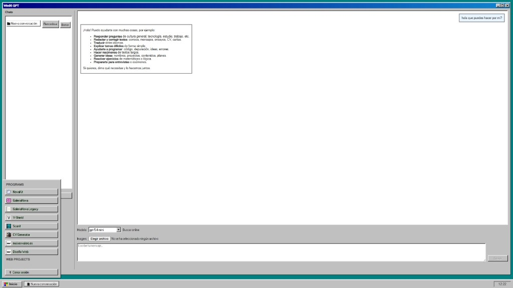

# Win95 GPT

Clon de chat estilo Windows 95/98 con SvelteKit + Supabase + OpenAI.



## Qué incluye

- UI Win95 (escritorio, ventana, barra de tareas, menú inicio)
- Chat persistente en Supabase
- Streaming de respuestas
- Búsqueda online
- Modo admin + modo invitado con límites
- PWA instalable (móvil/desktop)

## 1) Requisitos

- Node.js 18+
- Proyecto Supabase
- API Key de OpenAI

## 2) Variables de entorno

Copia `.env.example` a `.env` y rellena valores reales:

```env
PUBLIC_SUPABASE_URL=
PUBLIC_SUPABASE_ANON_KEY=
SUPABASE_SERVICE_ROLE_KEY=
OPENAI_API_KEY=
ALLOWED_EMAIL=
ALLOW_GUEST_LOGIN=true
GUEST_EMAIL=
GUEST_PASSWORD=
DEMO_EMAILS=
DEMO_MAX_RESPONSES_PER_DAY=20
DEMO_MAX_PROMPT_CHARS=1200
GUEST_MAX_RESPONSES_PER_DAY=8
GUEST_MAX_PROMPT_CHARS=700
PUBLIC_MODEL=gpt-5.4-mini
```

## 3) SQL de Supabase (tablas base)

Ejecuta esto en SQL Editor:

```sql
create table if not exists conversations (
  id uuid primary key default gen_random_uuid(),
  user_id uuid references auth.users not null,
  title text not null default 'Nueva conversación',
  created_at timestamptz default now(),
  updated_at timestamptz default now()
);

create table if not exists messages (
  id uuid primary key default gen_random_uuid(),
  conversation_id uuid references conversations(id) on delete cascade not null,
  role text check (role in ('user', 'assistant', 'system')) not null,
  content text not null,
  created_at timestamptz default now()
);

alter table conversations enable row level security;
alter table messages enable row level security;
```

## 4) Ejecutar en local

```bash
npm install
npm run dev
```

Abre `http://localhost:5173`.

## 5) Deploy en Vercel

1. Importa el repo en Vercel  
2. Añade las variables de entorno en **Project Settings -> Environment Variables**  
3. Redeploy  

## 6) Login

- **Admin**: email + password (usuario real de Supabase Auth)
- **Invitado**: botón sin password (usa `GUEST_EMAIL/GUEST_PASSWORD` en backend)

## 7) Licencia

Este proyecto usa licencia **CC BY-NC 4.0** (`LICENSE`), por lo que no se permite
uso comercial ni monetización sin permiso explícito del autor.
